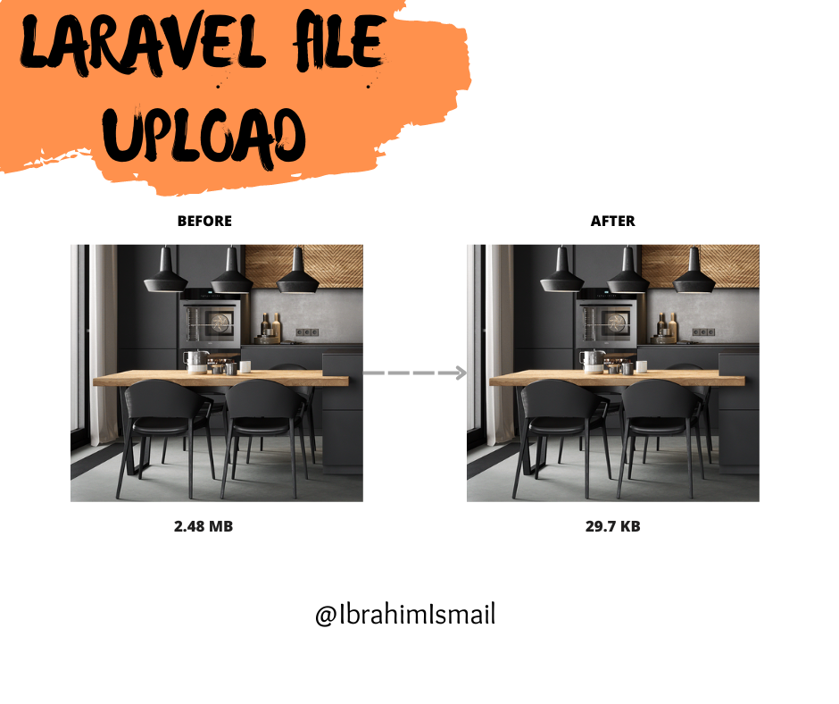

# File Upload Service

#### Description
Laravel file upload is a package that allows to you upload a single file or multiple files with auto-optimization, resizing, uses a smart combination of the best optimization and lossy compression algorithms to shrink images to the minimum possible size while keeping the required level of quality.


#### Installation
```bach
composer require i-ismail/laravel-file-upload
```
#### Publish Config File
```bach
php artisan vendor:publish --tag=file-upload-config
```
#### Packages dependency
1. [Intervention Image documentation](https://image.intervention.io/v2).
2. [Laravel-media library documentation](https://spatie.be/docs/laravel-medialibrary).

### 1- FileUploadService class
*This class store file and return file name to store it in your model*.
* it provide all methods in intervention image package.
* it provide auto-optimization and resizing.

Here are a few short examples of what you can do:

```php
$post = new Post();
//...
$post->image = FileUpload::make(request('image'))->store();

$post->save();
```
You can add folder path.
```php
$post = new Post();
//...
$post->image = FileUpload::make(request('image'))
->store('posts');

$post->save();
```
You can add disk, by default disk is public.
```php
$post = new Post();
//...
$post->image = FileUpload::make(request('image'))
->disk('s3')
->store('posts');

$post->save();
```

You can add custom file name.
```php
$post = new Post();
//...
$post->image = FileUpload::make(request('image'))
->fileName('my-image')
->store('posts');

$post->save();
```

You can add custom extension, By default, we
will set this value to "webp" for images.
```php
$post = new Post();
//...
$post->image = FileUpload::make(request('image'))
->extension('jpg')
->store('posts');

$post->save();
```

You can use ***all methods in intervention image package***.

```php
$post = new Post();
//...
$post->image = FileUpload::make(request('image'))
                    ->resize(400, 400)
                    ->crop(100, 100, 25, 25)
                    ->store('posts');
$post->save();
```
You can ***delete file***
```php
$post = Post::find(1);
//...
$post->image = FileUpload::delete($post->image);
```

You can use ***delete old file***, for example in update.
```php
$post = Post::find(1);
//...
$post->image = FileUpload::make(request('image'))
                    ->delete($post->image)
                    ->store('posts');
$post->save();
```
You can get path.
```php
$post = new Post();
//...
$fileUpload = FileUpload::make(request('image')); 
$post->image = $fileUpload->store('posts');
$filePath = $fileUpload->getFilePath();

$post->save();
```
***Note:*** you can clean code by Accessors & Mutators
```php
$post = Post::create([
        //...
]);

//In Post Model
public function setImageAttribute($image)
{
    $this->attributes['image'] = FileUpload::make($image)->store('posts');
}
``` 
To get image.
```php
//In Post Model
public function getImgAttribute()
{
    return $this->image ? asset('storage/'. $this->image) : asset('images/post.jpg');
}
``` 
***Dont forget*** run this command.
```bach
php artisan storage:link
```
****

### 2- MediaUploadService class
*This class use media-library package to store media files for your model*.
* it provide all methods in intervention image package.
* it provide all methods in media-library package.
* it provide auto-optimization and resizing.

#### Preparing the database
You need to publish the migration to create the media table:

```bach
php artisan vendor:publish --provider="Spatie\MediaLibrary\MediaLibraryServiceProvider" --tag="migrations"
```
After that, you need to run migrations.

```bach
php artisan migrate
```

#### Publishing the config file
Publishing the config file is optional:

```bach
php artisan vendor:publish --provider="Spatie\MediaLibrary\MediaLibraryServiceProvider" --tag="config"
```

#### Preparing your model
```php
use Spatie\MediaLibrary\HasMedia;
use Spatie\MediaLibrary\InteractsWithMedia;

class Post extends Model  implements HasMedia
{
    use InteractsWithMedia;
    ...
}
```

Here are a few short examples of what you can do:
```php
$post = new Post();
//...
$post->save();
MediaUpload::make(request('images'))->setModel($post)->store();

```
You can add collection.
```php
$post = new Post();
//...
$post->save();

MediaUpload::make(request('images'))
->setModel($post)
->store('posts');

```

You can add disk, by default disk is public.
```php
$post = new Post();
//...
$post->save();

MediaUpload::make(request('images'))
->setModel($post)
->disk('s3')
->store('posts');

```
***You can use all methods in intervention image package before setModel method***
```php
$post = new Post();
//...
$post->save();
MediaUpload::make(request('images'))
    ->resize(500, 200)
    ->crop(100, 100, 25, 25)
    ->setModel($post)
    ->store('posts');
```
***You can use all methods in media library package after setModel method***.
```php
$post = new Post();
//...
$post->save();
MediaUpload::make(request('images')) 
    ->resize(500, 200)
    ->setModel($post)
    ->usingName('my-image-name')
    ->withCustomProperties([
        'primaryColor' => 'red',
        'image-code'  => '12458558',
    ])
    ->store('posts');
```
#### Retrieving media
```php
$post->getMedia('posts'); // posts is collection name.
```
This method returns a collection of Media-objects.

retrieving the first media and the URL for the first media.
```php
$post->getFirstMedia('posts');

$post->getFirstMediaUrl('posts');
```

#### Delete media
You can remove something from the library by simply calling delete on an instance of Media:
```php
$mediaItem->delete();
```
Delete Model
```php
$post->delete(); // all associated files will be deleted as well.

$post->deletePreservingMedia(); // all associated files will be preserved.
```
***recommend:*** read [Laravel-media library documentation](https://spatie.be/docs/laravel-medialibrary).
